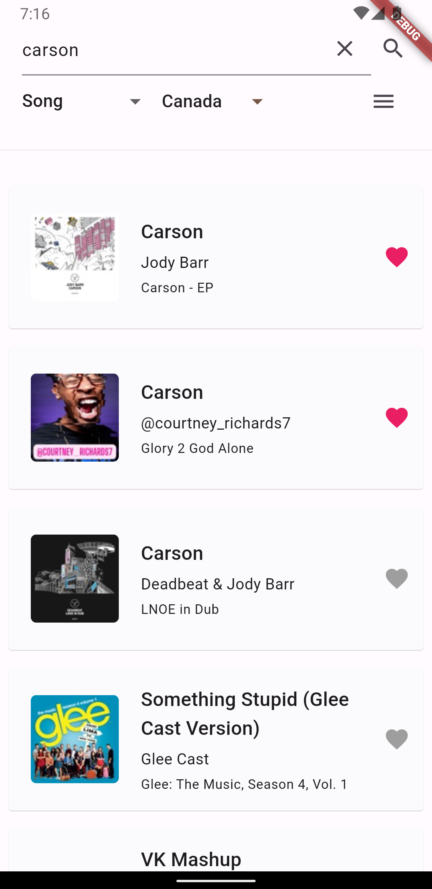
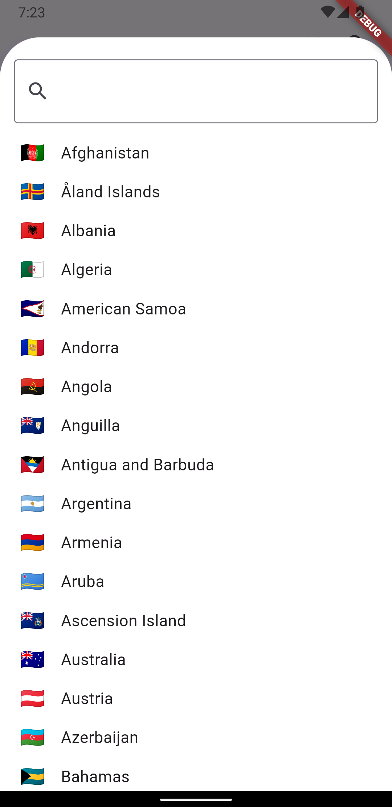
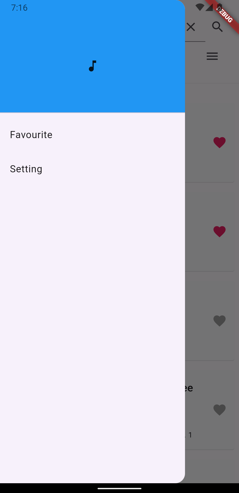
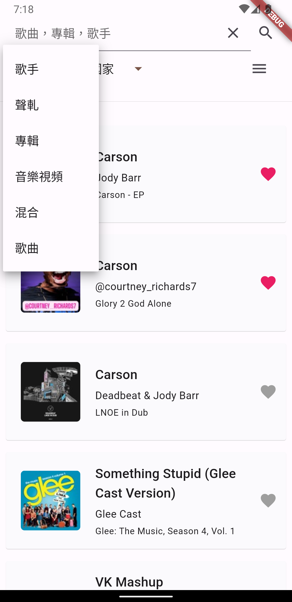
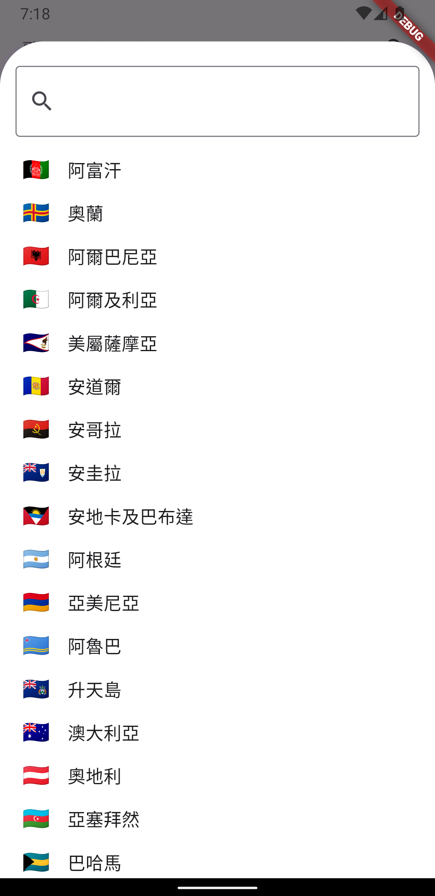

# Itunes Api Search App

A Cross-platform Flutter app with iTunes API integration. This app follows the MVVM architectural pattern.

## Requirement
- Flutter SDK
- VSCode

## How to start

1. clone project to local

    ```bash
    git clone https://github.com/whysobusy/itunes_api_api.git
    ```

2. install [Flutter](https://flutter.io/docs/get-started/install) (Android)


3. build & run in the project directory

    ```bash
    flutter run --profile
    ```
## Mobile Preview (Android)

|  |  |  |  |
|:--------------------------------------------------------------------------:|:------------------------------------------------------------------------------:|:------------------------------------------------------------------------------:|:--------------------------------------------------------------------------:|
|  |  |  |  |

## Features
- Search Functionality: Users can enter keywords into the search bar to find song, albumn or artist, which includes filter options for country and media type.
- List View with Cards: The app retrieves and displays information about the searched content in a scrollable List View. Each item is presented as a card, showcasing details such as the artist, album, and cover image.
- Paging: The app implements paging functionality to limit the initial number of items displayed in the List View. Additional data is retrieved from the iTunes API as the user scrolls to the end of the list, ensuring a continuous browsing experience.
- Bookmarking: Users can bookmark their favorite songs by tapping an Icon button on each List View card. 
- Multi-language Support: The app is available in English, Traditional Chinese and Simplified Chinese
- Unit test: The test cases ensure that the SongRemoteService class returns the correct data.

## Possible Improvement
- UI test
- Integration test

